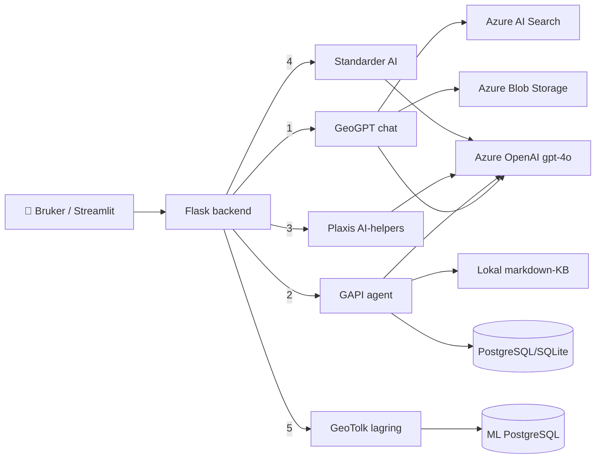
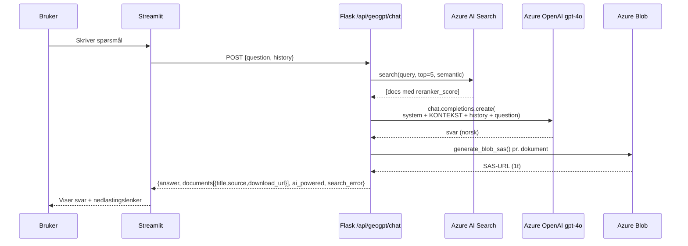
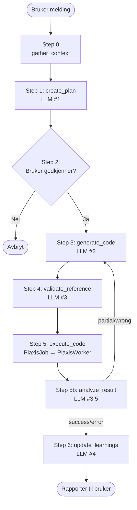
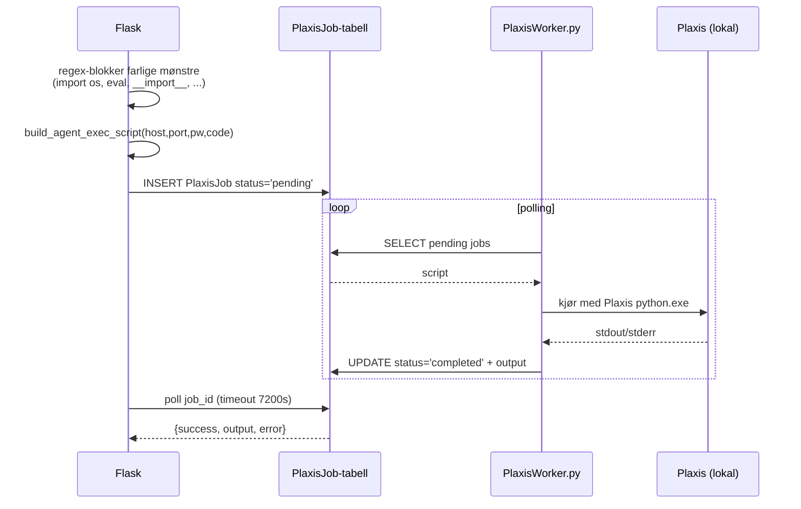

# RamGAP — AI- og ML-arkitektur

> Komplett oversikt over **all AI og maskinlæring** i RamGAP: hvilke modeller
> brukes, hvor de kalles fra, hvilke prompter og parametere som styrer dem,
> hvordan kunnskap hentes og hvordan flytene henger sammen.
>
> Målgruppen er utviklere og ingeniører som skal videreutvikle, feilsøke eller
> auditere AI-funksjonene.

---

## Innholdsfortegnelse

1. [Oversikt — alle AI-tjenester på ett brett](#1-oversikt)
2. [Modeller, leverandører og SDK-er](#2-modeller-leverandører-og-sdk-er)
3. [Konfigurering (miljøvariabler og fallback)](#3-konfigurering)
4. [Kunnskapskilder og retrieval](#4-kunnskapskilder-og-retrieval)
5. [Aktivitet 1 — GeoGPT (RAG-chat)](#5-geogpt--rag-chat-over-azure-ai-search)
6. [Aktivitet 2 — GAPI / Plaxis Agent (6-stegs pipeline)](#6-gapi--plaxis-agent-6-stegs-pipeline)
7. [Aktivitet 3 — Plaxis AI-helpers (kvalitetssjekk + rapport)](#7-plaxis-ai-helpers)
8. [Aktivitet 4 — Standarder (samsvar + forklaring)](#8-standarder--samsvar--og-paragrafforklaring)
9. [Aktivitet 5 — GeoTolk (ML-datainnsamling, ingen prediksjon i dag)](#9-geotolk--ml-datagrunnlag)
10. [Persistent læring — GapiLearning-tabellen](#10-persistent-læring--gapilearning)
11. [Hva som *ikke* er AI](#11-hva-som-ikke-er-ai)
12. [Sikkerhet, kostnader og kvoter](#12-sikkerhet-kostnader-og-kvoter)
13. [Kjente begrensninger og fremtidige forbedringer](#13-kjente-begrensninger-og-fremtidige-forbedringer)
14. [Appendiks A — Filreferanser](#appendiks-a--filreferanser)
15. [Appendiks B — System-prompter (verbatim)](#appendiks-b--system-prompter-verbatim)

---

## 1. Oversikt

RamGAP bruker AI på **fem distinkte steder**. Alle bruker samme primær-modell
(Azure OpenAI `gpt-4o`) men med svært forskjellige rolle-prompter,
kontekst-kilder og pipelines.

| # | Aktivitet | Type | Modell | Retrieval / Kontekst | Antall LLM-kall pr. forespørsel |
|---|-----------|------|--------|----------------------|---------------------------------|
| 1 | **GeoGPT** | RAG-chat | Azure OpenAI `gpt-4o` | Azure AI Search (`geogpt-knowledge`) + Blob | 1 |
| 2 | **GAPI / Plaxis Agent** | Multi-step agent | Azure OpenAI `gpt-4o` | DB-læringer + lokal markdown-KB + bruker-PDF | 4–5 (plan → kode → validering → resultat-analyse → observer) |
| 3 | **Plaxis AI-helpers** | One-shot LLM | Azure OpenAI `gpt-4o` | Plaxis-modellstatus (JSON) | 1 (kvalitetssjekk *eller* rapport) |
| 4 | **Standarder** | One-shot LLM | Azure OpenAI `gpt-4o` | Eurokode/NS-paragrafer + prosjektfiler | 1 (check *eller* explain) |
| 5 | **GeoTolk** | **Datainnsamling for fremtidig ML** | – ingen modell i dag – | – | 0 |



---

## 2. Modeller, leverandører og SDK-er

### Primærleverandør: **Azure OpenAI**
- Deployment: `gpt-4o` (kan overstyres per modul via env, se neste seksjon)
- API-versjon: `2025-01-01-preview` (default i [backend/config.py](backend/config.py#L36))
  - GeoGPT-modulen pinner spesifikt til `2024-12-01-preview` for kompatibilitet
    med semantic ranker, se [backend/activities/geogpt/routes.py](backend/activities/geogpt/routes.py#L37)
- SDK: `openai>=1.30.0` (klassen `openai.AzureOpenAI`)

### Fallback: **OpenAI (cloud)**
- Brukes kun av GAPI/Plaxis-agent når Azure-keys mangler.
- Modell: `gpt-4o` (`OPENAI_MODEL`).
- Se `_get_client()` i [backend/activities/plaxis_agent/service.py](backend/activities/plaxis_agent/service.py).

### Søk og lagring
- **Azure AI Search** (`azure-search-documents>=11.4.0`): semantisk søk + simple
  keyword som fallback. Indeks `geogpt-knowledge`, datasource `geogpt-blob`,
  indexer `geogpt-indexer`. Se [backend/activities/geogpt/indexer.py](backend/activities/geogpt/indexer.py).
- **Azure Blob Storage** (`azure-storage-blob>=12.19.0`): råfiler for GeoGPT
  (`geogpt-knowledge`-container) og bruker-PDF-er som GAPI laster opp.
- **Azure AI Projects/Identity** (`azure-ai-projects>=2.0.0`, `azure-identity>=1.14.0`):
  Foundry-SDK ligger som *avhengighet* men er ikke aktivt brukt fra backend i dag.

### PDF-uthenting (ikke "AI" men nær koblet)
- `pymupdf>=1.24.0` (`fitz`) som primær PDF-parser.
- `pypdf>=4.0.0` som fallback.
- Brukes av GAPI (PDF-vedlegg) og Standarder (standarder-paragrafer + prosjekt-rapporter).
- Se [backend/activities/standarder/parser.py](backend/activities/standarder/parser.py#L53).

### Lokal vektorbutikk — finnes i requirements, brukes IKKE
- `faiss-cpu>=1.7.0` og config-variablene `FAISS_IDX_FULL` / `FAISS_IDX_SHORT`
  er deklarert ([backend/config.py](backend/config.py#L45-L46)) men det er **ingen
  aktiv FAISS-indeksering i den nåværende koden**. RAG skjer enten via Azure
  AI Search (GeoGPT) eller via regex-basert intent-mapping mot markdown
  (GAPI). Se også [Begrensninger](#13-kjente-begrensninger-og-fremtidige-forbedringer).
- `EMBED_MODEL=text-embedding-3-large` er definert men **ingen kode kaller
  embeddings-API**.

### ML-stack — kun datainnsamling
- Egen Azure PostgreSQL-database (env-var `ML_DATABASE_URL`).
- SQLAlchemy-modeller i `MLBase`-metadataen.
- Tabell `geotolk_ml_training` lagrer hele SND-signalet + menneskelig tolkede
  lag for senere trening. **Ingen ML-modell er trent eller deployet i dag.**

---

## 3. Konfigurering

Alle AI-funksjoner styres av miljøvariabler i `.env`. Defaultverdier ligger i
[backend/config.py](backend/config.py).

### Påkrevd for full AI-funksjonalitet

```env
# Azure OpenAI (primær)
AZURE_OPENAI_ENDPOINT=https://<resource>.openai.azure.com/
AZURE_OPENAI_API_KEY=<key>
AZURE_OPENAI_DEPLOYMENT=gpt-4o
AZURE_OPENAI_API_VERSION=2025-01-01-preview

# Azure AI Search (kun GeoGPT)
AZURE_SEARCH_ENDPOINT=https://<service>.search.windows.net
AZURE_SEARCH_KEY=<admin-key>
AZURE_SEARCH_INDEX=geogpt-knowledge

# Azure Blob Storage (GeoGPT dokumenter + brukervedlegg)
AZURE_STORAGE_CONNECTION_STRING=DefaultEndpointsProtocol=...
GEOGPT_BLOB_CONTAINER=geogpt-knowledge

# OpenAI fallback (valgfri, brukes av GAPI hvis Azure mangler)
OPENAI_API_KEY=sk-...
OPENAI_MODEL=gpt-4o

# Per-modul overstyring (valgfri)
GEOGPT_DEPLOYMENT=gpt-4o-mini       # billigere modell kun for GeoGPT
GEOGPT_SYSTEM_PROMPT=...            # overstyr default norsk-prompt

# ML-database (kun GeoTolk-datainnsamling)
ML_DATABASE_URL=postgresql+psycopg2://...
```

### Hvordan modulene velger klient

| Modul | Velgelogikk |
|-------|-------------|
| GeoGPT | Kun Azure OpenAI. Returnerer `ai_powered: false` hvis env mangler — viser likevel rådokumenter fra Search. |
| GAPI/Plaxis-agent | `_get_client()` prøver Azure først, faller tilbake til OpenAI. Kaster `RuntimeError` hvis ingen. |
| Plaxis AI-helpers | Kun Azure OpenAI. |
| Standarder | Kun Azure OpenAI. |

---

## 4. Kunnskapskilder og retrieval

RamGAP kombinerer **tre retrieval-strategier** — én pr. AI-modul som trenger
kontekst.

### 4.1 Azure AI Search — semantisk + keyword (GeoGPT)
- Indekserer Blob-container `geogpt-knowledge` (PDF, DOCX, MD).
- Felter: `id`, `content`, `title`, `source`, `metadata_storage_name/path/size/last_modified/content_type`.
- Bruker `SemanticConfiguration`/`SemanticSearch` med reranker (`@search.reranker_score`).
  Faller automatisk tilbake til `query_type='simple'` hvis tieren ikke støtter
  semantic ranker. Se `_search_documents()` i
  [backend/activities/geogpt/routes.py](backend/activities/geogpt/routes.py#L84).
- Henter top 5 chunks pr. spørring.

### 4.2 Filbasert markdown-KB med intent-mapping (GAPI)
- Filer:
  - `docs/plaxis_2d_commands.md` — ~243 kommandoer, 17 818 linjer, 523 KB.
  - `docs/plaxis_2d_reference.md` — kompakt API-signatur pr. kommando, 263 KB.
- **Ingen vektor-embeddings.** Søk gjøres med:
  1. **Norsk intent-mapping** (regex-mønstre): `"spunt|plate|vegg"` →
     `["plate", "platemat", "dumpplates", "setmaterial"]`. Definert som
     `_INTENT_MAP` i [backend/activities/plaxis_agent/knowledge.py](backend/activities/plaxis_agent/knowledge.py#L125).
  2. **Eksakt + delstreng-matching** mot kommando-navn (scorer: +3 hel
     match, +2 ord-in-cmd, +1 cmd-in-ord).
  3. Returnerer top-k seksjoner som "API-kort" til LLM-prompten.
- Reference-validering: regex henter alle `g_i.foo()`/`g_o.bar()`-kall fra
  generert kode og slår opp i `plaxis_2d_reference.md` for verifisering.

### 4.3 Database-lærings-injeksjon (GAPI)
- Tabell `gapi_learnings` (markdown, scope `global` / `user`).
- Siste versjon pr. scope lastes som ekstra system-melding før hver
  plan-generering. Avkortes til 2000 tegn.

### 4.4 Bruker-PDF-er (GAPI + Standarder)
- Brukeren laster opp prosjekt-PDF (rapport, tegning).
- Tekst trekkes ut med `pymupdf` → `pypdf` fallback.
- Avkortes til 50 000 tegn ved API-grensesnitt, 6 000 tegn ved injeksjon
  i LLM-prompt.

---

## 5. GeoGPT — RAG-chat over Azure AI Search

Endepunkt: `POST /api/geogpt/chat`
Frontend: [frontend/pages/geogpt.py](frontend/pages/geogpt.py)
API-klient: [frontend/components/api_client.py](frontend/components/api_client.py)

### Flyt



### System-prompt (default)
```
Du er GeoGPT, en ekspert-assistent for geoteknikk. Svar alltid på norsk.
Baser svarene dine på dokumentene gitt som kontekst.
Gi korte, presise svar med fagterminologi. Bruk punktlister der det passer.
Unngå lange innledninger — gå rett på sak.
Hvis konteksten ikke dekker spørsmålet, si kort fra og gi et konsist svar
basert på generell geoteknisk kunnskap.
```
Kan overstyres med `GEOGPT_SYSTEM_PROMPT`.

### Kontekst-injeksjon
- Top-5 dokumenter konkateneres som `KONTEKST:\n[tittel]\n...innhold...`
- Chat-historikk inkluderes (siste meldinger).
- Det er **ingen citation-håndtering** i koden — modellen oppfordres bare
  til å bruke konteksten, ikke å sitere konkrete IDer.

### Returstruktur
```json
{
  "answer": "...",
  "documents": [
    {"title": "Eurokode 7.pdf", "source": "geogpt-knowledge/eurokode7.pdf", "download_url": "https://...?sas=..."}
  ],
  "ai_powered": true,
  "search_error": null
}
```

### Admin-funksjoner
- `geogpt_admins.json` definerer hvem som kan CRUD-redigere kuraterte
  Q&A-oppføringer i `geogpt_knowledge.json`.
- CRUD-endepunkter: `GET/POST/PUT/DELETE /api/geogpt/knowledge`.
- Disse oppføringene er *uavhengige* av Azure AI Search-indeksen — de er en
  manuelt vedlikeholdt liste som vises i UI for "vanlige spørsmål".

### Indeksering
Skript `RamGAP/scripts/setup_gapi_index.py` (eller bruk
[backend/activities/geogpt/indexer.py](backend/activities/geogpt/indexer.py)) oppretter:
- `SearchIndex` med felt + `SemanticConfiguration`
- `SearchIndexerDataSourceConnection` mot Blob-container
- `SearchIndexer` med `IndexingSchedule` og `FieldMapping`
  (henter `metadata_storage_*` automatisk)

---

## 6. GAPI — Plaxis Agent (6-stegs pipeline)

Den klart mest komplekse AI-flyten i RamGAP. Genererer Plaxis Python-kode fra
norske naturlig-språk-instruksjoner, kjører den mot brukerens lokale
Plaxis-installasjon, og lærer av resultatet.

Backend: [backend/activities/plaxis_agent/service.py](backend/activities/plaxis_agent/service.py)
Frontend: [frontend/pages/plaxis_agent.py](frontend/pages/plaxis_agent.py)

### 6.1 Overordnet pipeline



### 6.2 Step 0 — `gather_context()`

Henter:
- **GapiLearning global** — siste markdown-versjon fra DB (`scope='global'`).
- **GapiLearning user** — per-bruker erfaringer (`scope='user', scope_key=username`).
- **Brukerens valgte kontekst** — sjekkboks-valgte standarder/dokumenter fra UI.
- **Modellstatus** — JSON-snapshot av aktiv Plaxis-modell (faser, materialer,
  geometri-elementer) — hentes ved å kjøre en intro-script via PlaxisWorker.
- **Bruker-PDF** — opptil 6 000 tegn ekstrahert tekst.
- **API-kort** — top-k kommando-seksjoner via intent-mapping.

### 6.3 Step 1 — `create_plan()` (LLM-kall #1)

System-prompt instruerer modellen til å returnere strukturert JSON:

```json
{
  "forståelse": "Kort gjenfortelling av hva brukeren vil",
  "steg": [
    {"nr": 1, "beskrivelse": "...", "kommandoer": ["mesh","calculate"],
     "risiko": "lav|medium|høy", "kan_automatiseres": true}
  ],
  "standard_advarsler": ["..."],
  "modellerings_tips": ["..."],
  "manglende_info": ["..."],
  "ønsket_output": "Hva brukeren forventer å se etter kjøring"
}
```

**Risiko-skala:**
- `lav` — kun lesning (`Phases.count()`, hente materialdata).
- `medium` — opprettelse/endring av geometri eller materialer.
- `høy` — meshing eller `calculate()` (kan ta minutter, irreversibel for
  Plaxis-undo-stack).

`max_completion_tokens=2048` for plan-kallet.

### 6.4 Step 2 — godkjenningsport (frontend)

UI viser planen som expandere pr. steg. Bruker kan:
- Godkjenne → `POST /api/plaxis-agent/execute-plan` med plan-JSON.
- Avvise → planen forkastes, læringslogg oppdateres ikke.

### 6.5 Step 3 — `generate_code()` (LLM-kall #2)

System-prompt (forkortet — se [Appendiks B](#appendiks-b--system-prompter-verbatim)):
- "Returner KUN ren Python-kode — ingen markdown."
- "ALDRI kall `new_server()` — allerede tilkoblet (`g_i`, `s_i`, `g_o`, `s_o`)."
- Detaljerte mønstre for `gotostructures()` / `gotostages()`, fase-tilgang,
  plate-geometri, materialer, og **kritiske retry-regler** ved geometriendring
  i optimaliserings-loops.

Modellen får i tillegg:
- Plan-tekst (forståelse + steg)
- API-kort for alle kommandoer i planen
- Læringslogg (top 2000 tegn)
- Brukervalgt kontekst
- Modellstatus-JSON (avkortet til 1500 tegn)
- Bruker-PDF (avkortet til 6000 tegn)
- Chat-historikk (siste 8 meldinger)

`max_completion_tokens=4096`. Output renses for ```python```-fences.

### 6.6 Step 4 — `validate_code()` (LLM-kall #3)

Et tredje LLM-kall som validerer den genererte koden mot
`plaxis_2d_reference.md`. Henter relevante referansekort ved å regex-pløye
gjennom koden for `g_i.foo()` / `g_o.bar()`-kall.

Sjekker 12 vanlige feilkilder, bl.a.:
- Riktig modus (`gotostructures()` før Plates, `gotostages()` før Phases).
- `DeformCalcType.value` er INT, ikke streng.
- `plate.Parent.First/Second` (ikke `plate.Point_1`).
- `g_i.move(punkt, (dx,dy))` (relativ flytting, ikke absolutt tilordning).
- **`ShouldCalculate = True` på alle faser før `g_i.calculate()`** —
  ellers bruker Plaxis CACHET resultat.

Sikkerhetsnett: hvis det validerte svaret er <30% av originalens lengde,
returneres originalen uendret (anti-truncation guard).

### 6.7 Step 5 — `execute_code()` via PlaxisWorker



**Blokkerte mønstre** (regex):
- `g.new(`, `new_server(`
- `import os`, `import subprocess`
- `open(`, `__import__(`, `eval(`

Jobben submittes via SQLAlchemy. PlaxisWorker er en separat Python-prosess
(typisk pakket med PyInstaller — se `PlaxisWorker.spec`) som kjører i
Plaxis sin egen Python.

### 6.8 Step 5b — `analyze_result()` (LLM-kall #3.5)

Sammenligner faktisk output mot planens `ønsket_output`. Returnerer JSON:

```json
{
  "status": "success | partial | wrong | error",
  "matched": true,
  "forklaring": "...",
  "mangler": ["..."],
  "retry_hint": "Konkret instruksjon til neste kodegenerering"
}
```

Brukes for **auto-retry** (frontend kan tilby å regenerere kode med
`retry_hint` som ekstra system-melding).

Fast-path: hvis `success=false` + `output=""` + `error!=None` → returner
`status="error"` direkte uten LLM-kall (sparer tokens).

### 6.9 Step 6 — `update_learnings()` (LLM-kall #4 — Observer)

Etter hver kjøring (vellykket eller feilet) kalles en *observer-prompt* som
oppdaterer den persistente læringsloggen i `gapi_learnings`-tabellen.

Modellen får:
- Forrige versjon av læringsloggen (markdown)
- Brukerens opprinnelige melding
- Planen som ble godkjent
- Generert kode
- Faktisk output / feil
- Resultat-analysens `forklaring` og `mangler`

**Output-regler:**
- Returner kun ny markdown-fil (maks 300 linjer).
- Behold eksisterende lærdom (ikke skriv om alt).
- Legg til ny lærdom som "## YYYY-MM-DD — kort tittel".
- Slett gamle/avlegse lærdommer hvis fil > 300 linjer.

Lagres med `scope='global'` (eller `scope='user', scope_key=username` for
per-bruker observasjoner). Bare siste rad pr. scope brukes som kontekst.

`max_completion_tokens=2048`.

### 6.10 Endepunkter (frontend → backend)

| Endepunkt | Beskrivelse |
|-----------|-------------|
| `POST /api/plaxis-agent/plan` | Steg 0+1 — returnerer plan + kontekst-sammendrag |
| `POST /api/plaxis-agent/execute-plan` | Steg 3+4+5+5b — kode → valider → kjør → analyser |
| `POST /api/plaxis-agent/chat` | Eldre "uten plan"-flyt (legacy) |
| `POST /api/plaxis-agent/execute` | Direkte kode-eksekvering (debug) |
| `POST /api/plaxis-agent/upload-pdf` | Laster opp PDF-vedlegg |
| `GET  /api/plaxis-agent/learnings/latest?scope=global` | Henter siste læringslogg |

---

## 7. Plaxis AI-helpers

To enklere "one-shot" AI-funksjoner som kjører direkte mot Plaxis-modellen,
uten retrieval eller multi-step planlegging.

Backend: [backend/activities/plaxis/routes.py](backend/activities/plaxis/routes.py)

### 7.1 `POST /api/plaxis/ai-quality-check`

Sjekker modell-status mot 5 dimensjoner:

| Dimensjon | Sjekkpunkter |
|-----------|--------------|
| Geometri & randbetingelser | Modellgrenser, fixities, symmetri |
| Materialegenskaper | Realistiske parametre, modellvalg (HS/MC/SS), drainage |
| Strukturer | Plate-stivhet, ankerforspenning, grensesnitt |
| Faser | Initielle spenninger, K0, Σ-Mstage, gravity-loading |
| Vannforhold | Grunnvannsnivå, poretrykk, konsolidering |

Modellen får full JSON-modellstatus og rangerer hver dimensjon med
✅ / ⚠️ / ❌ + kort norsk forklaring.

System-prompt er en "norsk geoteknisk ingeniør med 20+ års
Plaxis-erfaring". Output i strukturert markdown.

### 7.2 `POST /api/plaxis/ai-report`

Genererer **Eurokode 7 / NS-EN-konform** beregningsrapport i 5 seksjoner:
1. **Innledning og forutsetninger** — modelltype, akser, koordinatsystem.
2. **Geometri og randbetingelser**
3. **Materialer og modeller** — referanser til NS-EN 1997-1.
4. **Faser og lasttilfeller** — designkravs-vurdering.
5. **Resultater og kapasitetsutnyttelse** — FoS-krav (ULS ≥ 1.4, SLS ≥ 1.0).

Tar emot full modellstatus + valgfri kalkulasjons-output. Returnerer ferdig
markdown som kan eksporteres til DOCX/PDF.

---

## 8. Standarder — samsvar + paragraf-forklaring

Backend: [backend/activities/standarder/routes.py](backend/activities/standarder/routes.py)
Frontend: [frontend/pages/standarder.py](frontend/pages/standarder.py)

To AI-funksjoner over indekserte standardparagrafer (Eurokode 7, NS-EN,
N400, V220 osv.).

### 8.1 `POST /api/standarder/check`

Tar inn:
- Liste over paragraf-IDer (valgt fra UI-tre).
- Prosjektkontekst-blokk (sammenstilt fra prosjektfiler: rapporter,
  Plaxis-output, modeling-resultater).
- Valgfri ekstra tekst fra bruker.

Returnerer pr. paragraf:
- ✅ Oppfylt — kort begrunnelse + sitat
- ⚠️ Delvis — hva mangler
- ❌ Brudd — konkret avvik med målbar referanse

### 8.2 `POST /api/standarder/explain`

Tar én paragraf + valgfri prosjektkontekst, returnerer plain-language norsk
forklaring rettet mot ingeniør-praktiker. Bruker prosjektkonteksten til
å gi *konkret* eksempel ("for ditt prosjekt med spunt 8 m og leire-lag...").

### 8.3 PDF-tekstutvinning
`POST /api/standarder/extract-report` ekstraherer tekst fra
prosjekt-filer (PDF/DOCX/TXT/MD/CSV/JSON) for bruk som kontekst.

- PDF: PyMuPDF (`fitz`) → pypdf fallback
- DOCX: `zipfile` + XML-parser
- Andre: direkte tekstlesing
- Returnerer `is_scanned=true` hvis < 100 tegn — UI viser da advarsel om
  at OCR trengs.

---

## 9. GeoTolk — ML-datagrunnlag

**Viktig:** GeoTolk inneholder *ingen aktiv AI eller ML* i dag. Det er en
ren tolknings-app der ingeniøren manuelt klassifiserer jordlag fra
SND-grunnboringer. Verdien for AI ligger i at *hver tolkning lagres som et
strukturert treningseksempel* for fremtidig sekvensmodell.

Backend: [backend/activities/geotolk/routes.py](backend/activities/geotolk/routes.py)
Datamodell: `GeoTolkMLTrainingData` i [backend/core/models.py](backend/core/models.py#L356)

### Hva lagres pr. tolket borehull

| Felt | Beskrivelse |
|------|-------------|
| `sounding_data` | JSON: `{"depth":[...], "c2":[...], "c3":[...], "c4":[...]}` — komplett signal |
| `snd_raw_content` | Originalt SND-filinnhold linje for linje |
| `snd_header` | Header-tekst (koordinater, metode, dato) |
| `layers` | Menneskelig labels: `[{"type":"leire","start":0.0,"end":5.0}, ...]` |
| `num_layers` | Antall lag |
| `events` | `{"spyling":[[start,end]], "slag":[[start,end]]}` |
| `coord_x/y/z` | UTM easting / northing / elevation |
| `has_oedometer` | Boolean for kalibreringsdata |
| `interpreted_by` | Brukernavn (audit) |

Endepunkt `GET /api/geotolk/training-data` eksporterer datasettet for
fremtidige ML-pipelines.

### Datalagring
- **Egen Azure PostgreSQL-database** (`ML_DATABASE_URL`).
- Separert fra hoved-DB via `get_ml_session()` for å kunne trene/exportere
  uten å påvirke produksjons-DB.

### Fremtidig modell-idé
Sekvens-til-sekvens klassifisering (Bi-LSTM eller 1D-CNN) som tar
`(depth, c2, c3, c4)` som input og predikerer lag-grenser + lag-type.
Treningsdata bygges opp gradvis fra produksjons-tolkninger.

---

## 10. Persistent læring — `GapiLearning`

Tabell: `gapi_learnings` (definert i [backend/core/models.py](backend/core/models.py#L535))

| Kolonne | Beskrivelse |
|---------|-------------|
| `id` | PK |
| `scope` | `'global'` / `'project'` / `'user'` |
| `scope_key` | `project_id` eller `username` (null for global) |
| `session_id` | Agent-session som produserte denne versjonen |
| `title` | Kort tittel (sjelden brukt) |
| `content` | Markdown — maks 300 linjer |
| `username` | Hvem som trigget oppdateringen |
| `created_at` / `updated_at` | Timestamps |

**Lese-mønster:** Kun siste rad pr. `(scope, scope_key)` brukes som
kontekst-injeksjon i plan- og kode-prompter.

**Skrive-mønster:** En ny rad opprettes etter hver agent-kjøring. Forrige
versjon ligger igjen som historikk. Observer-prompten skriver alltid
*hele* markdown-filen på nytt, så hver rad er en komplett snapshot.

Eksempel på struktur i `content`:
```markdown
# GAPI læringslogg

## 2025-10-14 — Plate-flytting krever remesh
Når `move()` brukes på `plate.Parent.Second`, må man kalle
`gotomesh(); mesh(0.06); gotostages()` før `calculate()` …

## 2025-10-12 — DeformCalcType er INT
`phase.DeformCalcType.value` returnerer integer, ikke streng. Bruk
`str(phase.DeformCalcType)` for sammenligning …
```

---

## 11. Hva som *ikke* er AI

For å unngå forvirring — disse modulene har "intelligent"-klingende navn
men inneholder **null AI/ML**:

| Modul | Hva det faktisk er |
|-------|--------------------|
| `backend/activities/modeling/tormur_optimizer.py` | Klassisk numerisk optimering (constraint-solver for Tørmur V220-veggdimensjoner). Ingen modell, ingen LLM. |
| `backend/activities/quiz/` | Scoreboard-CRUD for NS-EN 1997-1-quiz. Spørsmålene er hardkodet/manuelt skrevet, ingen AI-generering. |
| `backend/activities/geotolk/` (interpretation) | Mennesket utfører tolkningen. Backend lagrer kun. *Datainnsamling for fremtidig ML, ikke AI i dag.* |
| `EMBED_MODEL`, `FAISS_*` config-variabler | Definert i config men ingen kode kaller dem i nåværende kodebase. |

---

## 12. Sikkerhet, kostnader og kvoter

### Sikkerhet
- **Kode-eksekvering (GAPI Step 5):** regex-blokk for `import os`,
  `subprocess`, `open()`, `eval()`, `__import__()`. Dette er en *defense in
  depth*-mekanisme — siden koden kjører i Plaxis sin Python-prosess på
  klient-PC har den lokal kontekst. Brukeren må eksplisitt starte
  PlaxisWorker.
- **Hemmelig-håndtering:** alle keys via `os.getenv()` — ingen hardkoding.
  Verdier til `AZURE_OPENAI_ENDPOINT` strippes for citater (`.strip('"').strip("'")`).
- **SAS-URLs (GeoGPT downloads):** tids-begrensede (1 time default),
  read-only, generert pr. forespørsel.
- **PII:** Brukernavn lagres i `GapiLearning.username` og i
  `GeoTolkMLTrainingData.interpreted_by`. Vurder anonymisering før eksport
  av ML-datasett.
- **Admin-gate (GeoGPT):** `geogpt_admins.json` whitelist for CRUD —
  ikke en sterk autentiseringsmekanisme i seg selv, krever
  Streamlit-auth foran (`frontend/components/auth.py`).

### Token-bruk pr. forespørsel (estimat)

| Modul | Input tokens | Output tokens | LLM-kall |
|-------|--------------|---------------|----------|
| GeoGPT | ~1500 (5 chunks) | ~500 | 1 |
| GAPI plan | ~3000–5000 | ~1500 | 1 |
| GAPI kode | ~5000–10000 | ~3000 | 1 |
| GAPI valider | ~5000 | ~3000 | 1 |
| GAPI analyse | ~500 | ~300 | 1 |
| GAPI observer | ~3000 | ~1500 | 1 |
| Plaxis AI-helper | ~2000 | ~1500 | 1 |
| Standarder check | ~2000 + paragrafer | ~1500 | 1 |

**En full GAPI-syklus = ~25 000 input + ~9 000 output tokens.** Med gpt-4o
prising (sept-2024) ≈ 0.13 USD pr. komplett kjøring.

### Kvoter
- Azure OpenAI har TPM-grenser pr. deployment — sjekk i Azure Portal under
  "Quotas" hvis du får 429-feil.
- Azure AI Search Basic tier støtter ikke semantic ranker — koden faller
  automatisk tilbake til simple search og logger feilen til
  `search_error`-feltet.

---

## 13. Kjente begrensninger og fremtidige forbedringer

### Begrensninger i dag
1. **Embeddings er konfigurert men ikke brukt.** `EMBED_MODEL =
   text-embedding-3-large` er aldri kalt. All "RAG" gjøres enten via
   Azure AI Search (semantic ranker) eller regex-intent-mapping. Det er
   ingen vektor-indeks for `plaxis_2d_commands.md` eller læringsloggen.
2. **FAISS er deklarert som dependency men ikke brukt.** Variabler
   `FAISS_IDX_FULL`, `FAISS_IDX_SHORT`, `DOC_IDS_FILE` peker på filer
   som ikke opprettes av noen aktiv kode.
3. **Ingen citations i GeoGPT-svar.** Modellen får kontekst men instrueres
   ikke til å sitere bestemte chunk-IDer.
4. **GAPI-validering er LLM-basert.** Burde supplere med syntaks-validering
   (`ast.parse`) og statisk analyse av Plaxis-API-kall.
5. **GeoTolk-ML har ingen modell.** Datasettet vokser men ingen
   trening/inferens-pipeline finnes.
6. **Ingen evaluering / regression tests for prompts.** Endringer i system-
   prompter kan stille forringe kvaliteten uten å fanges opp.
7. **Læringsloggen kan drive.** Observer-prompten kan i prinsippet skrive om
   gode lærdommer til dårlige — det finnes ingen review-gate.

### Anbefalte forbedringer (prioritert)

| # | Tiltak | Påvirker |
|---|--------|----------|
| 1 | Aktiver `text-embedding-3-large` for `plaxis_2d_commands.md` med Chroma/FAISS — erstatt regex-intent-map | GAPI nøyaktighet |
| 2 | Legg til AST-validering i Step 4 — fang syntax-feil før LLM-kall | GAPI hastighet + kost |
| 3 | Versjoner GapiLearning som git-spor (en fil pr. commit) | Sporbarhet |
| 4 | Bygg eval-suite med 20–50 kjente gode/dårlige Plaxis-oppgaver | Prompt-regresjon |
| 5 | Tren første GeoTolk-sekvensmodell når datasett > 200 borehull | Ny ML-funksjonalitet |
| 6 | Citation-format i GeoGPT-svar (`[Eurokode7.pdf §2.3.1]`) | UX |
| 7 | Token-telling og kost-rapportering pr. bruker | Drift |
| 8 | Streaming responses (Server-Sent Events) for GeoGPT og GAPI plan | UX-latency |

---

## Appendiks A — Filreferanser

### Backend (AI-kode)
- [backend/config.py](backend/config.py) — alle env-variabler
- [backend/activities/geogpt/routes.py](backend/activities/geogpt/routes.py) — GeoGPT chat + Search + Blob
- [backend/activities/geogpt/indexer.py](backend/activities/geogpt/indexer.py) — Azure Search indeks-oppsett
- [backend/activities/plaxis_agent/service.py](backend/activities/plaxis_agent/service.py) — GAPI 6-stegs pipeline
- [backend/activities/plaxis_agent/knowledge.py](backend/activities/plaxis_agent/knowledge.py) — markdown KB + intent-map
- [backend/activities/plaxis_agent/routes.py](backend/activities/plaxis_agent/routes.py) — GAPI endepunkter
- [backend/activities/plaxis/routes.py](backend/activities/plaxis/routes.py) — Plaxis AI-helpers
- [backend/activities/standarder/routes.py](backend/activities/standarder/routes.py) — Samsvar + forklaring
- [backend/activities/standarder/parser.py](backend/activities/standarder/parser.py) — PDF/DOCX-uthenting
- [backend/activities/geotolk/routes.py](backend/activities/geotolk/routes.py) — ML-data-lagring
- [backend/core/models.py](backend/core/models.py) — `GapiLearning`, `GeoTolkMLTrainingData`, `PlaxisJob`
- [backend/core/database.py](backend/core/database.py) — `get_db_session`, `get_ml_session`

### Frontend
- [frontend/pages/geogpt.py](frontend/pages/geogpt.py) — GeoGPT chat-UI
- [frontend/pages/plaxis_agent.py](frontend/pages/plaxis_agent.py) — GAPI UI med plan-godkjenning
- [frontend/pages/standarder.py](frontend/pages/standarder.py) — Standarder-tre + AI-forklaring
- [frontend/components/api_client.py](frontend/components/api_client.py) — HTTP-klient mot backend

### Data
- [docs/plaxis_2d_commands.md](docs/plaxis_2d_commands.md) — 243 Plaxis-kommandoer
- [docs/plaxis_2d_reference.md](docs/plaxis_2d_reference.md) — API-signaturer
- [backend/data/geogpt_knowledge.json](backend/data/geogpt_knowledge.json) — kuraterte Q&A
- [backend/data/geogpt_admins.json](backend/data/geogpt_admins.json) — admin-whitelist

### Skript
- [scripts/setup_gapi_index.py](scripts/setup_gapi_index.py) — opprett Azure Search-indeks
- [scripts/build_plaxis_reference.py](scripts/build_plaxis_reference.py) — bygg `plaxis_2d_reference.md`
- [scripts/extract_plaxis_docs.py](scripts/extract_plaxis_docs.py) — eksporter rå Plaxis-dokumentasjon

---

## Appendiks B — System-prompter (verbatim)

### B.1 GeoGPT
```
Du er GeoGPT, en ekspert-assistent for geoteknikk. Svar alltid på norsk.
Baser svarene dine på dokumentene gitt som kontekst.
Gi korte, presise svar med fagterminologi. Bruk punktlister der det passer.
Unngå lange innledninger — gå rett på sak.
Hvis konteksten ikke dekker spørsmålet, si kort fra og gi et konsist svar
basert på generell geoteknisk kunnskap.
```

### B.2 GAPI Step 3 — kodegenerering (utdrag)
```
Du er en PLAXIS Python-kodegenerator innebygd i RamGAP.
Du får en godkjent plan og skal generere kode som implementerer ALLE stegene.

ABSOLUTTE REGLER:
• Returner KUN ren Python-kode — ingen markdown, ingen ```-blokker.
• ALDRI kall new_server(), ALDRI importer plxscripting — allerede tilkoblet.
• ALDRI kall g_i.new() — operer på eksisterende prosjekt.
• Tilgjengelige variabler (ferdig tilkoblet):
  g_i  = PLAXIS input-server   (alias: g)
  s_i  = input connection       (alias: s)
  g_o  = PLAXIS output-server
  s_o  = output connection
• ALLTID try/except rundt hver seksjon.
• ALLTID print() med === SEKSJONSNAVN === og ITEM: prefix.
• Siste linje: # FERDIG

KORREKTE PLAXIS PYTHON MØNSTRE (OBLIGATORISK):

KRITISK — MODUS BESTEMMER HVA SAMLINGER RETURNERER:
  g_i.gotostructures() → g_i.Plates gir strukturelle objekter
  g_i.gotostages()     → g_i.Plates gir FASE-sub-elementer
  Du MÅ kalle gotostructures() FØR du leser Plates, Anchors, etc.
  Du MÅ kalle gotostages() FØR du bruker Phases eller calculate().

Fase-tilgang — kall gotostages() først (ALDRI g_i.Phase_xxx):
  g_i.gotostages()
  phase = None
  for ph in g_i.Phases:
      if ph.Identification.value == "fasenavn":
          phase = ph
          break

Etter geometriendring MÅ du remeshe og beregne ALLE faser:
  g_i.gotomesh()
  g_i.mesh(0.06)
  g_i.gotostages()
  for ph in g_i.Phases:
      ph.ShouldCalculate = True   ← OBLIGATORISK!
  g_i.calculate()
```
(Full versjon: se `_CODE_SYSTEM_PROMPT` i
[backend/activities/plaxis_agent/service.py](backend/activities/plaxis_agent/service.py))

### B.3 GAPI Step 4 — kode-validering
```
Du er en Plaxis API-ekspert. Valider Python-kode mot Plaxis 2D-referansen.

SJEKK OG RETT OPP disse vanlige feil:
1. MODUS: g_i.gotostructures() MÅ kalles FØR Plates/Anchors-tilgang.
2. DeformCalcType.value er INT — ALDRI "Safety" in int. Bruk str().
3. Plater: iterer g_i.Plates og match Name.value. ALDRI g_i.PlateName.
4. Geometri: plate.Parent.First/Second. ALDRI plate.Point_1/StartPoint/EndPoint.
5. Flytte: g_i.move(punkt, (dx, dy)). ALDRI punkt.y.value = verdi.
6. Safety: phase.Reached.SumMsf.value ELLER phase.SumMsf.value.
7. Fase: g_i.gotostages() først, iterer g_i.Phases. ALDRI g_i.Phase_xxx.
8. ETTER geometriendring: g_i.gotomesh(); g_i.mesh(0.06); g_i.gotostages(); g_i.calculate()
9. Før move() → g_i.gotostructures().
10. Optimalisering: move → mesh → calculate() (ALLE faser) per iterasjon.
11. KRITISK: Før g_i.calculate() i en loop MÅ du sette ShouldCalculate=True på
    ALLE faser. Uten dette returnerer beregninga CACHED resultater.
12. I optimaliseringsloop: hent plate/linje/punkt-referanser PÅ NYTT etter remesh.

Returner KUN korrigert Python-kode. Ingen forklaring. Ingen markdown.
Hvis koden er korrekt, returner den UENDRET.
```

### B.4 GAPI Step 5b — resultat-analyse
```
Du er en kritisk evaluator for GAPI, et AI-system som kjører PLAXIS-kode.

Du får:
- «Ønsket output» fra planen (hva brukeren forventet)
- Faktisk output fra kjøringen
- Eventuell feilmelding

Evaluer om kjøringen leverte det som ble forventet, og svar ALLTID med gyldig JSON:
{
  "status": "success" | "partial" | "wrong" | "error",
  "matched": true | false,
  "forklaring": "Kort norsk forklaring av hva som skjedde",
  "mangler": ["Liste med konkrete ting som mangler eller er feil"],
  "retry_hint": "Konkret instruksjon til neste kodegenerering for å fikse dette"
}

DEFINISJONER:
• success  — output inneholder det som ble etterspurt, ingen feil
• partial  — noe output finnes men deler mangler
• wrong    — output finnes men er feil type/innhold
• error    — kjøringen produserte en feil eller tom output

REGLER:
• Returner KUN gyldig JSON — ingen forklaring utenfor JSON.
• Svar på norsk i tekstfeltene.
• retry_hint skal være presis nok til å bruke direkte som instruksjon.
```

### B.5 GAPI Step 6 — Observer
Se `_OBSERVER_PROMPT` i
[backend/activities/plaxis_agent/service.py](backend/activities/plaxis_agent/service.py)
(rundt linje 690). Hovedinstruks:
- Returner full markdown-fil (maks 300 linjer).
- Behold tidligere lærdommer.
- Legg til nye lærdommer som `## YYYY-MM-DD — tittel`.
- Slett avlegse/gamle hvis filen blir for lang.

### B.6 Plaxis AI-helpers og Standarder
Disse er kortere og mer prosjekt-spesifikke — se direkte i
[backend/activities/plaxis/routes.py](backend/activities/plaxis/routes.py) og
[backend/activities/standarder/routes.py](backend/activities/standarder/routes.py)
for å unngå dobbeltvedlikehold.

---

*Sist oppdatert: dette dokumentet ble generert ved kodeinspeksjon. Hvis du
endrer en system-prompt eller pipeline-struktur, oppdater også denne filen
slik at den fortsetter å være sannheten om systemet.*
